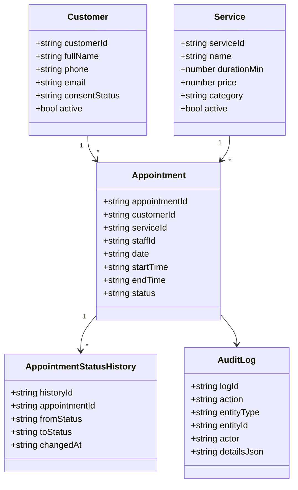
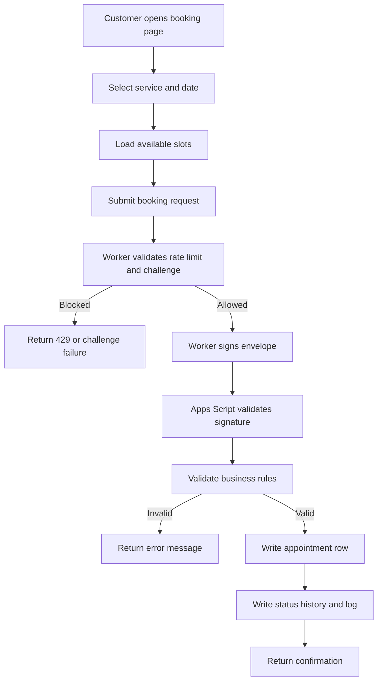

# Nail Salon System Design

## System Actors
- Guest Customer
- Receptionist
- Nail Technician
- Manager/Admin
- Platform Scheduler
- Security Operator

## Top Use Cases
- Book appointment
- Reschedule appointment
- Cancel appointment
- Manage service catalog
- View operational dashboard
- Generate daily summary report

## Functional Requirements
- Customer profile create/update/search/deactivate
- Service catalog with duration and price
- Appointment lifecycle with overlap prevention
- Daily schedule listing for admin view
- Reports summary for appointment and revenue estimates
- Immutable-like action logs for changes

## Non-Functional Requirements
- Responsive UI for mobile and desktop
- Standardized API response envelope
- Role and signature checks on backend routes
- Rate limiting at edge gateway
- Backup and restore operational procedure

## Class Diagram (Mermaid)

## Activity Diagram (Booking)

## Hosting Decision
Cloudflare Pages is preferred over GitHub Pages for this solution because it has stronger integrated security controls and native edge execution for request filtering and rate limiting.
